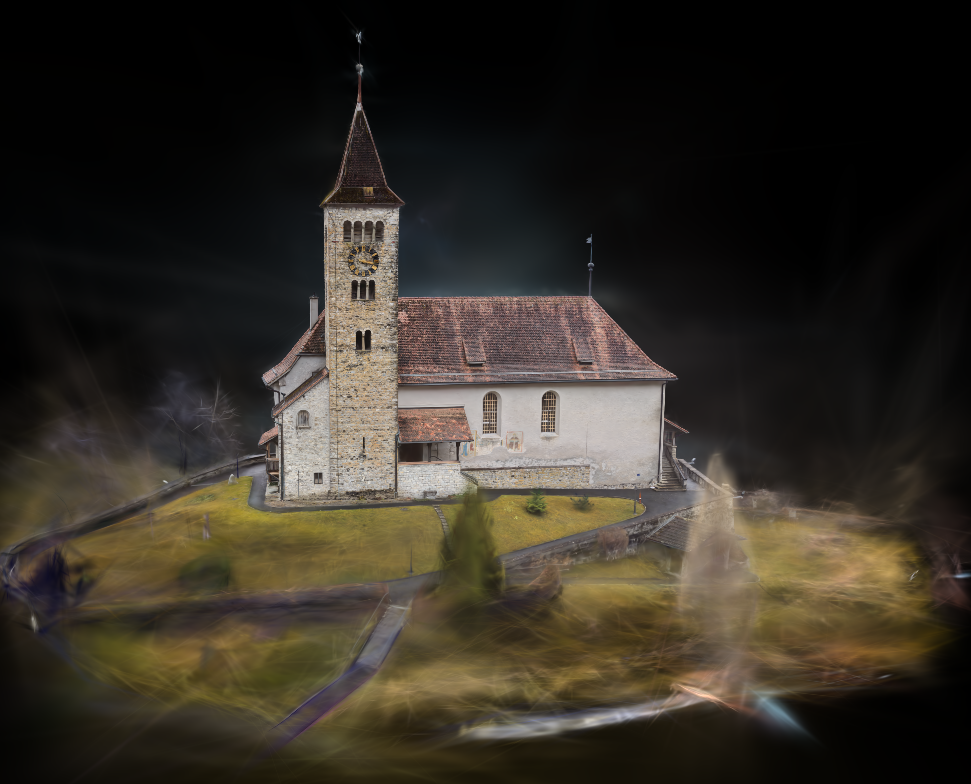

# RS Brush Pipeline

Automatic RealityScan → Gaussian Splatting Pipeline

This project creates a fully automated workflow for:

- RealityScan image alignment
- AI mask generation
- COLMAP sparse export
- Automatic Gaussian Splat training with Brush or Lichtfeld Studio

The pipeline directly converts raw drone or camera images into a trained Gaussian Splat scene.


---

# Features

- Fully automatic RealityScan CLI workflow
- Automatic AI mask generation
- Automatic COLMAP export
- Native `images/` and `sparse/0/` structure
- Brush integration
- Lichtfeld Studio integration
- No manual COLMAP processing required
- Embedded RealityScan export configuration
- Single Python script workflow

---

# Pipeline

```text
Raw Images
    ↓
RealityScan
    ↓
AI Masks
    ↓
Alignment / SfM
    ↓
COLMAP Export
    ↓
Gaussian Splat Training
```

---

# Why RealityScan?

RealityScan often produces significantly better camera alignment than standard COLMAP workflows, especially for:

- drone imagery
- smartphone images
- low texture scenes
- vegetation
- motion blur
- rolling shutter cameras

Better camera poses produce significantly better Gaussian Splat reconstructions.

---

# Dataset Structure

```text
dataset/
 ├── input/
 │    ├── IMG_0001.jpg
 │    ├── IMG_0002.jpg
 │    └── ...
 │
 ├── images/
 │    └── undistorted images
 │
 └── sparse/
      └── 0/
           ├── cameras.txt
           ├── images.txt
           └── points3D.txt
```

---

# Requirements

## Software

- Python 3.10+
- RealityScan 2.1+
- Brush App or Lichtfeld Studio

## RealityScan

Tested with:

- RealityScan 2.1.1

---

# Usage

## Basic Usage

```bash
python rs_brush2.py ./input
```

## Custom RealityScan Installation

```bash
python rs_brush2.py ./input "P:\Programme\Epic Games\RealityScan_2.1"
```

---

# RealityScan CLI Workflow

The script automatically performs:

```text
-addFolder
-generateAIMasks
-align
-exportRegistration
```

using the embedded COLMAP export configuration.

---

# Brush Training

The default trainer is:

```python
TRAINER = "brush"
```

Brush is started automatically after successful RealityScan export.

---

# Lichtfeld Studio

Optional support:

```python
TRAINER = "lichtfeld"
```

---

# Console Example

```text
Executing command 'generateAIMasks'
Generating Masks completed in 143 seconds.

Executing command 'align'
Feature detection completed in 53 seconds.
Reconstruction completed in 147 seconds.

Executing command 'exportRegistration'
Exporting Registration completed in 134 seconds.

Training took 10m 32s
```

---

# Advantages over Standard COLMAP

This workflow avoids:

- COLMAP feature extraction
- COLMAP matching
- COLMAP mapper

RealityScan performs the SfM stage directly and exports native COLMAP sparse files.

This often improves:

- camera stability
- sparse reconstruction quality
- Gaussian Splat quality
- reconstruction robustness

---

# Output

The script automatically generates:

```text
images/
sparse/0/
brush/
```

---

# Future Ideas

- batch processing
- GUI frontend
- PyInstaller EXE
- drag & drop support
- gsplat support
- nerfstudio support
- render farm support

---

# License

MIT License

---

# Credits

- RealityScan / RealityCapture — Epic Games
- Brush Gaussian Splatting
- Lichtfeld Studio
